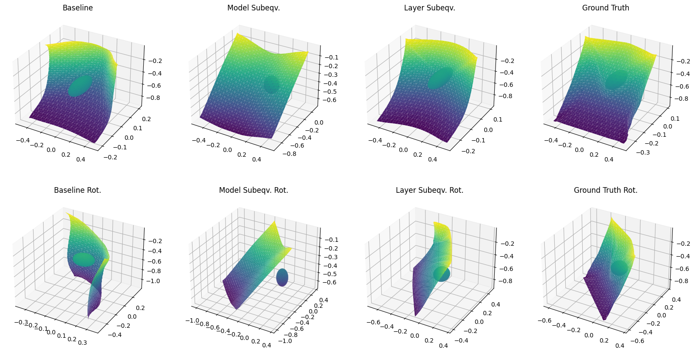
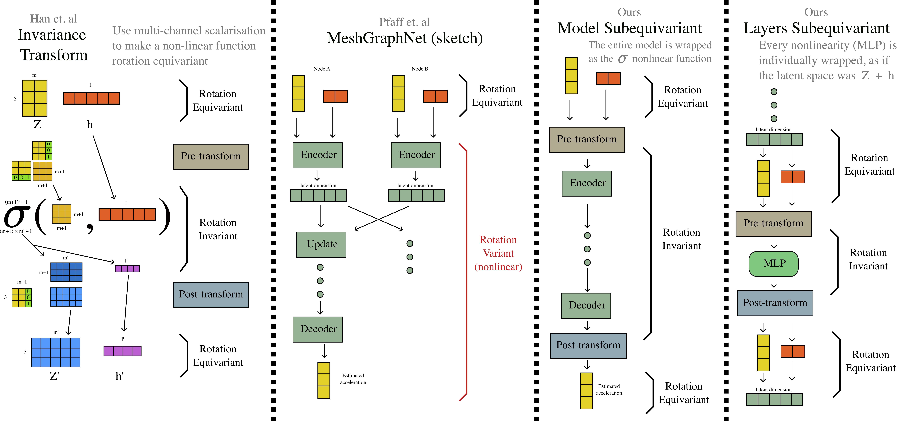

# Subequivariant Mesh Graph Networks

## Overview

This is an experiment trying to extend [Learning Mesh-Based Simulation with Graph Networks](https://arxiv.org/abs/2010.03409) ([code](https://github.com/google-deepmind/deepmind-research/tree/master/meshgraphnets)) by making the model subequivariant as described in [Learning Physical Dynamics with Subequivariant Graph Neural Networks](https://arxiv.org/abs/2210.06876) ([code](https://github.com/hanjq17/SGNN)). 




The code was intially forked from [meshgraphnets](https://arxiv.org/abs/2010.03409) and modified to include the subequivariant extensions.

## Method



The table shows the mean square error of prediction in base coordinates vs prediction in rotated coordinates rotated back (equivariant prediction), so how consistent the models are under rotation. Lower is better. 


| **$MSE_{subeqv}$** | **Machine Precision**              | **Base**                  | **Model Subeqv.**          | **Layer Subeqv.**            |
|----------------------------|-------------------------------|---------------------------|----------------------------|------------------------------|
| **Step 5**                 | $(2.6 \pm 0.7)\cdot 10^{-16}$ | $(3 \pm 1)\cdot 10^{-5}$  | $(8 \pm 2)\cdot 10^{-15}$  | $(2.3 \pm 0.9)\cdot 10^{-6}$ |
| **Step 500**               | $(2 \pm 1)\cdot 10^{-16}$     | $(3 \pm 2)\cdot 10^{-2} $ | $(3 \pm 6)\cdot 10^{-5} $ | $(10 \pm 3)\cdot 10^{-4}$   |

## Run 

Download dataset:

```sh
export DATA=/path/to/data
download_dataset.sh sphere_simple ${DATA}
```

Set up environment:

```sh
virtualenv --python=python3.6 "${ENV}"
${ENV}/bin/activate
pip install -r requirements.txt
```

Train and evaluate the model:

First run with `MODE=train` to train the model, then run with `MODE=eval` to evaluate the model. `rotation_angle` is ignored when `MODE=train`. You can also use `translate_[x,y,z]` to translate the coordinate system. The coordinate system is translated then rotated. 

```sh
export MODE=eval # or train

## sphere/base
python run_model.py --mode=${MODE} --model=cloth \
        --checkpoint_dir=${DATA}/chk/chk_sphere_base \
        --dataset_dir=${DATA}/sphere_simple \
        --rollout_path=${DATA}/rollout_sphere_base_45.pkl \
        --rotation_angle=45

## sphere/model
python run_model.py --mode=${MODE} --model=cloth \
        --checkpoint_dir=${DATA}/chk/chk_sphere_model \
        --dataset_dir=${DATA}/sphere_simple \
        --rollout_path=${DATA}/rollout_sphere_model_45.pkl \
        --subeq_model \
        --rotation_angle=45


## sphere/layers
python run_model.py --mode=${MODE} --model=cloth \
        --checkpoint_dir=${DATA}/chk/chk_sphere_layers \
        kv--dataset_dir=${DATA}/sphere_simple \
        --rollout_path=${DATA}/rollout_sphere_layers_45.pkl \
        --subeq_layers --subeq_encoder \
        --rotation_angle=45
```

Finally, you can plot the results:

```sh

python plot_cloth.py --rollout_path=${DATA}/rollout_sphere_[variant]_[rot_angle].pkl
```
